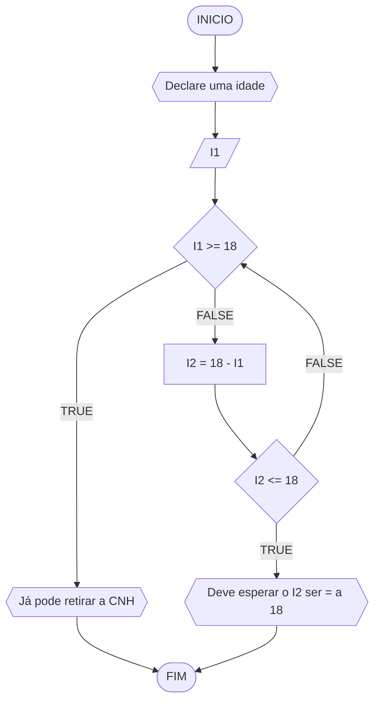

#### FLUXOGRAMA



#### PSEUDOCODIGO

```mermaid
flowchart TD
ALGORITMO
VERIFICAR I1, I2 NUMERICOS
ESCREVA "Declare uma idade"
LEIA I1
SE I1 >= 18 ENTAO
	ESCREVA "Já pode retirar a CNH"
SENAO 
	I2 = 18 - I1 
	SE I2 <= 18 ENTAO
		ESCREVE "Deve sua idade ser igual a 18"
	SENAO
		ESCREVA "Verifique novamente sua idade"
FIM


```
