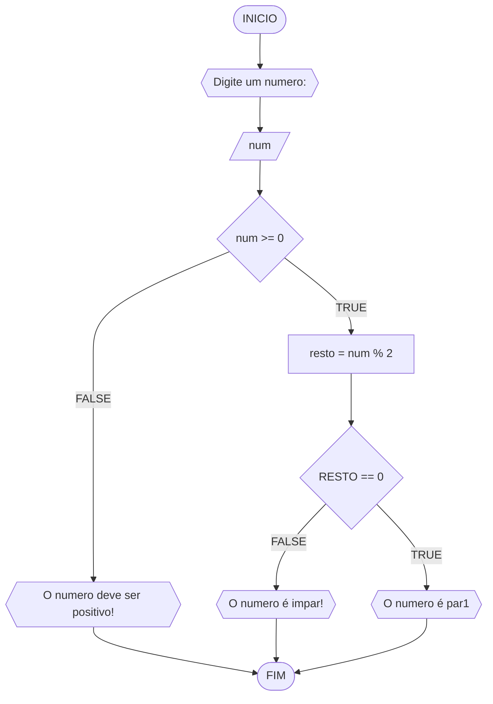

# UNIFOR
**Nome**: Inácio Araripe Figueiredo <br>
**Disciplina**: Raciocinio Lógico Algoritmo

## Lista de exercicios 01

### Exercicio 3
Represente, em fluxograma e pseudocodigo, um algoritmo para determinar se um número inteiro positivo é par ou impar.

#### Fluxograma



#### Pseudocodigo
``` 
ALGORITMO verifica_par_impar
Declare num, resto: INTEIRO
INICIO
ESCREVA"Digite um numero: "
LEIA num
SE num >= 0 ENTAO
    resto <- num % 2
    SE resto == 0 ENTAO
	    ESCREVA "O numero é par!"
	SENAO
		ESCREVA "O numero é impar!" 
	FIM_SE   
SENAO
	ESCREVA "O numero deve ser positivo!"
FIM_SE
FIM
```
#### TESTE
| num | resto | num >= 0 | resto == 0 | Saída |
| -- | -- | -- | -- | -- |
| -1 | FALSE | | | "O numero deve ser positivo" |
| 0 | TRUE | 0 | TRUE | "O numero deve ser par!" |
| 10 | TRUE | 0 | TRUE | "O numero deve ser par!" |
| 11 | TRUE | 0 | TRUE | "O numero deve ser impar!" |


```
