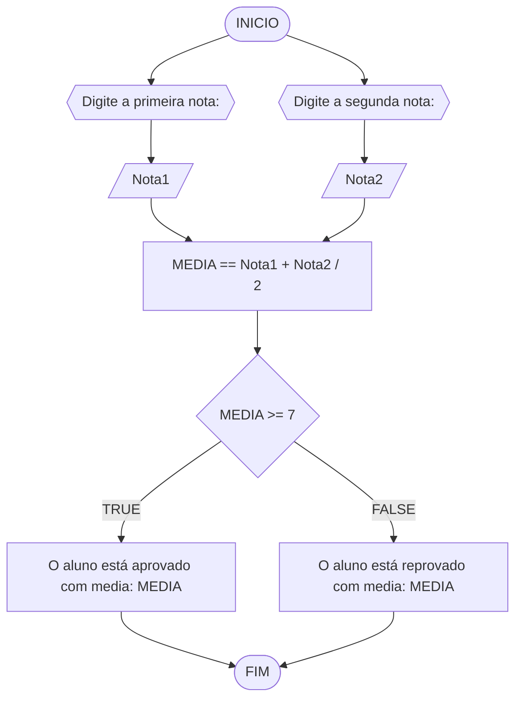

#### FLUXOGRAMA




#### PSEUDOCODIGO

```
ALGORITMO verificar_MEDIA
Declare Nota1, Nota2, MEDIA NUMERICO
ESCREVA "Digite a primeira nota do aluno: "
LEIA Nota1
ESCREVA "Digite a segunda nota do aluno: "
LEIA Nota2
MEDIA = (Nota1 +Nota2) / 2
SE MEDIA >= 7 ENTAO
	ESCREVA "O aluno foi aprovado com média igual: ", MEDIA
SENAO
	ESCREVA "O aluno foi reprovado com médiaa igual: ", MEDIA
FIM ALGORITMO 


```
                                                                                                                                                                                                                                                                                                                                                                                 
  

                                                                                                                                                                                                                                                                                                                                                                                 
  

