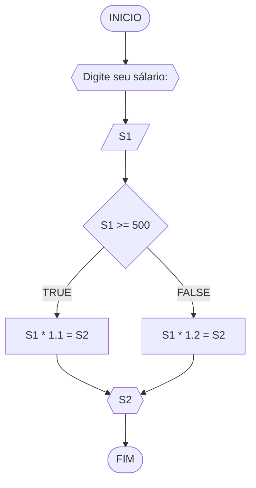

#### FLUXOGRAMA


#### PSEUDOCODIGO

```mermaid
flowchart TD
ALGORITMO verificar_NOVO SALARIO
DECLARE S1, S2 NUMERICOS
ESCREVA "Digite seu salario atual: "
LEIA S1
SE S1 >= 500 ENTAO
	S2 = S1 * 1.1
SENAO
	S2 = S1 * 1.2
ESCREVA "Seu novo salario é: ", S2
FIM ALGORITMO
```
