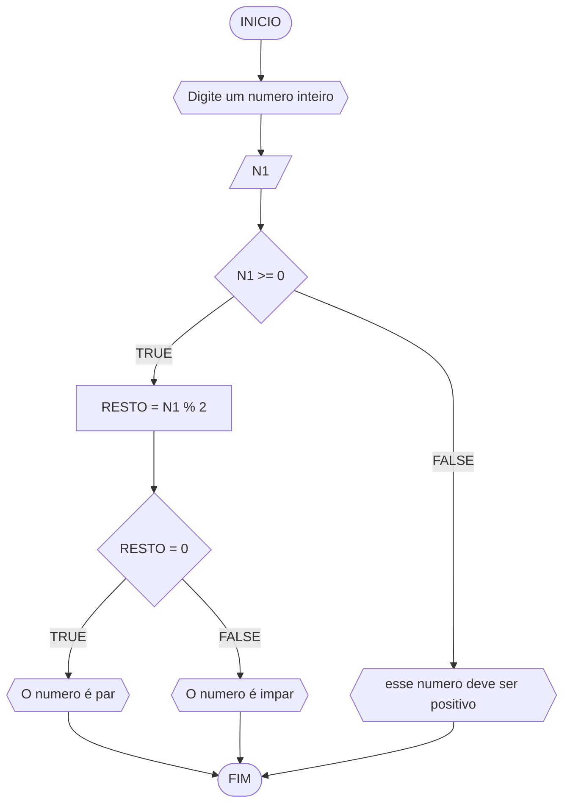

#### FLUXOGRAMA


#### PSEUDOCODIGO


```
ALGORITMO
DECLARE N1,RESTO INTEIRO
ESCREVA "Digite um numero inteiro"
LEIA N1
SE N1 >= 0 ENTAO
	RESTO = N1 % 2
	SE RESTO = 0 ENTAO
		ESCREVA "O numero é par"
	SENAO
		ESCREVA "O numero é impar"
	FIM_SE
SENAO
	ESCREVA "O numero é positivo"
FIM_SE
FIM

```
