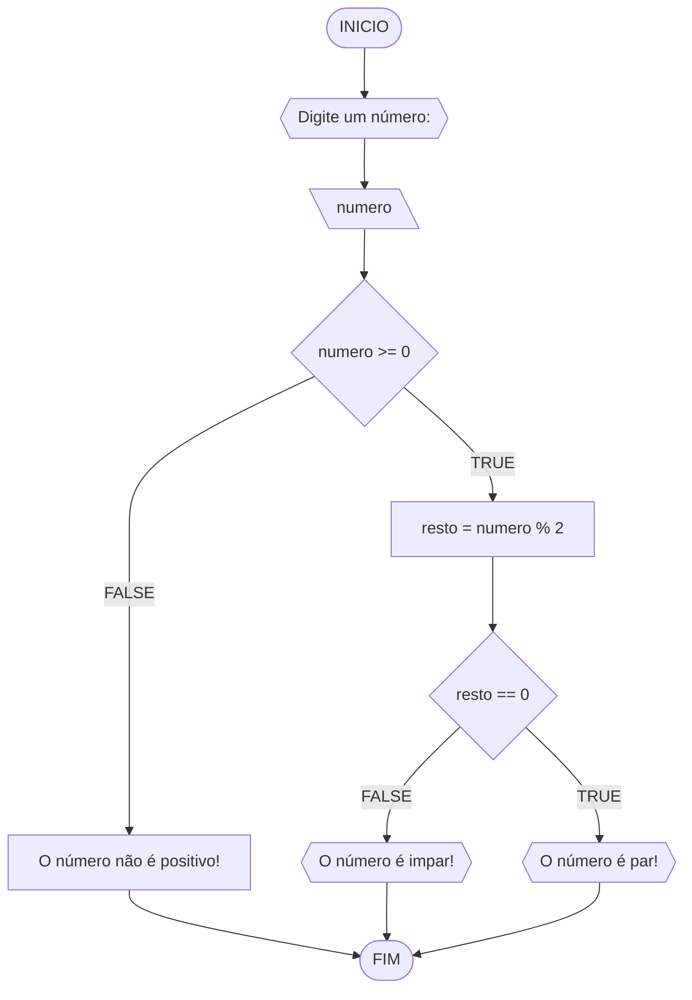
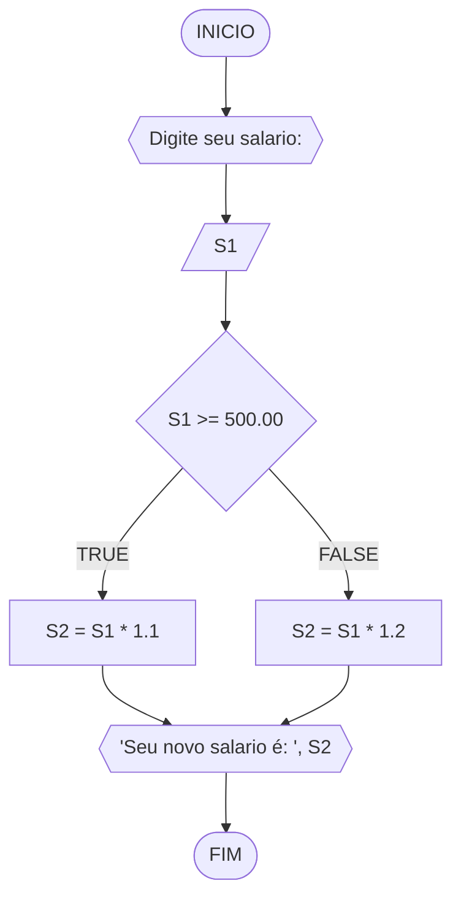
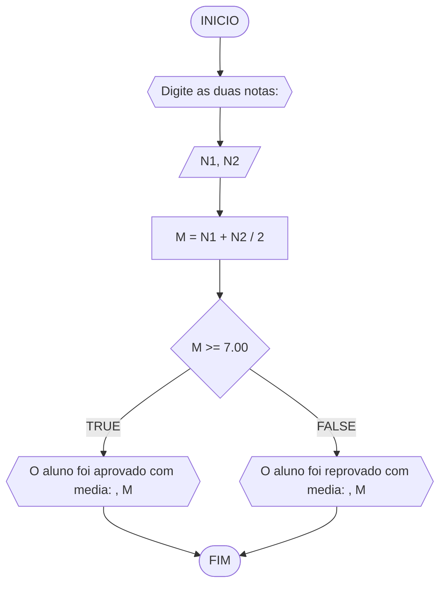
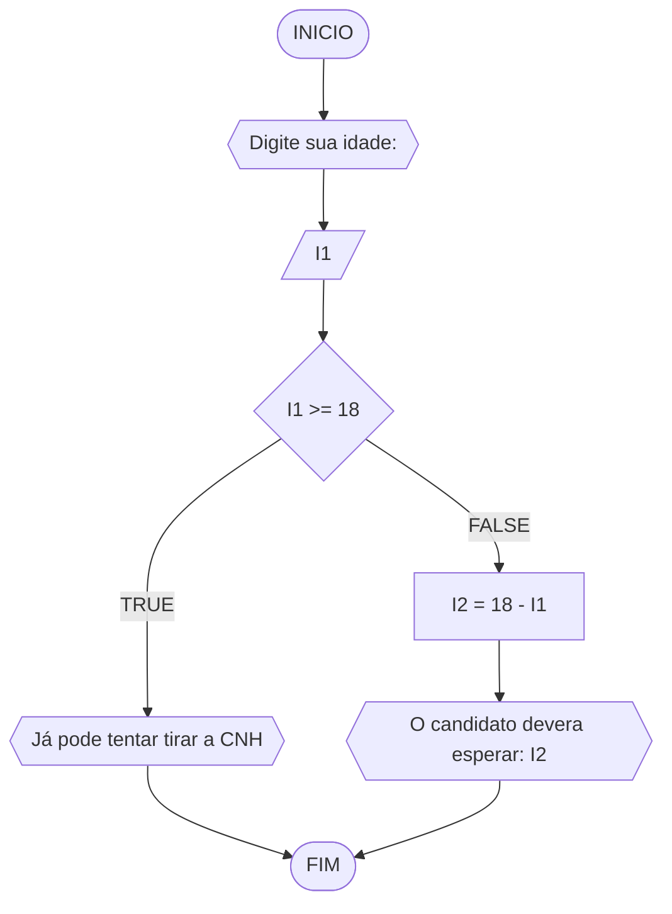

# UNIFOR
**Nome**: INACIO ARARIPE FIGUEIREDO <br>
**Disciplina**: Raciocínio lógico algorítmico

## Lista de exercícios 01

### Exercício 01 (1 ponto)
Represente, em fluxograma e pseudocódigo, um algoritmo para determinar se um número inteiro e positivo é par ou impar.

#### Fluxograma (0,25 ponto)



#### Pseudocódigo (0,5 ponto)
```
1  ALGORTIMO verifica_par_impar
2  DECLARE numero, resto: INTEIRO
3  ESCREVA "Digite um número: "
4  INICIO
4  LEIA numero
5  SE numero >= 0 ENTAO                  // verifica se o inteiro é positivo
6    resto = numero % 2                 // calcula o resto da divisão por 2
7    SE resto == 0 ENTAO                // verifica se o resto é igual a zero
8      ESCREVA "O número é par!"
9    SENAO
10     ESCREVA "O número é impar!"
11   FIM_SE
11  SENAO                                // caso inteiro for negativo (condição linha 5)
12    ESCREVA "O número deve ser postivo!"
13  FIM_SE
13 FIM
```

#### Teste de mesa (0,25 ponto)
| numero | numero >= 0 | resto | resto == 0 | Saída |
| -- | -- | -- | -- | -- | 
| -1 | F |   |   | "O número deve ser postivo!" |
| 0  | V | 0 | V | "O número é par!" |
| 13 | V | 1 | F | "O número é impar!" |
| 30 | V | 0 | V | "O número é par!" |

## Exercício 02 (3 pontos)
Represente, em fluxograma e pseudocódigo, um algoritmo para calcular o novo salário de um funcionário. 
Sabe-se que os funcionários que recebem atualmente salário de até R$ 500 terão aumento de 20%; os demais terão aumento de 10%.

#### FLUXOGRAMA



#### PSEUDOCODIGO
```
ALGORITMO salario
DECLARE S1, S2: REAIS
INICIO
ESCREVA "Digite seu salario: "
LEIA S1
SE S1 >= 500.00 ENTAO
	S2 = S1 * 1.1
SENAO
	S2 = S1 * 1.2
ESCREVA "Seu novo salario é: ", S2
FIM


```
#### Teste de mesa (1.0 ponto)

| S1 | S1 >= 500.00 | S2 | SAIDA | 
|      --      |      --      |      --      |      --      |
| 200     | FALSE       | 240.00    |  Seu novo salario é: 240.00     |
| 800   | TRUE          | 880.00        | Seu novo salario é: 880.00 |
|      500      |      TRUE      |      550.00      |      Seu novo salario é: 550.00      |
|      100      |      FALSE      |      120.00      |      Seu novo salario é: 120.00      |

## Exercício 03 (3 pontos)
Represente, em fluxograma e pseudocódigo, um algoritmo para calcular a média aritmética entre duas notas de um aluno e mostrar sua situação, que pode ser aprovado ou reprovado.

#### FLUXOGRAMA



#### PSEUDOCODIGO

```
ALGORITMO media
DECLARE N1, N2, M REAIS
INICIO
ESCREVA "Digite suas duas notas: "
LEIA N1, N2
M = N1 + N2 / 2
SE M >= 7.00 ENTAO
	ESCREVA "O aluno foi aprovado com media: ", M
SENAO 
	ESCREVA "O aluno foi reprovado com media: ", M
FIM


```

#### Teste de mesa (1 ponto)

| N1 | N2 | M | M >= 7.00 | SAIDA |
|      --      |      --      |      --      |      --      |      --      |
| 8.00     | 7.00      | 7.50    |  TRUE     | Aluno aprovado |
| 5.00   | 6.00          | 5.50        | FALSE | Aluno reprovado |
|      3.00      |      8.00      |      5.50      |      FALSE      |      Aluno reprovado      |
|      8.00      |      8.00      |      8.00      |      TRUE      |      Aluno aprovado      |

## Exercício 04 (3 pontos)
Represente, em fluxograma e pseudocódigo, um algoritmo que, a partir da idade do candidato(a), determinar se pode ou não tirar a CNH. 
Caso não atender a restrição de idade, calcular quantos anos faltam para o candidato estar apto.

#### FLUXOGRAMA


#### PSEUDOCODIGO

```
ALGORITMO CNH
VERIFICAR I1, I2 NUMERICOS
INICIO
ESCREVA "Digite sua idade: "
LEIA I1
SE I1 >= 18 ENTAO
	ESCREVA "Já pode tirar a CNH"
SENAO
	I2 = 18 - I1
	ESCREVA "O candidato devera esperar: ", I2
FIM


```

#### Teste de mesa (1.0 ponto)

| I1 | I1 >= 18 | I2 | SAIDA | 
|      --      |      --      |      --      |      --      |
| 18     | TRUE       | 0    |  Já pode tirar a CNH     |
| 19   | TRUE          | -1        | Já pode tirar a CNH |
|      15      |      FALSE      |      3      |      O candidato deve esperar 3 anos      |
|      13      |      FALSE      |      5      |      O candidato deve esperar 5 anos      |
