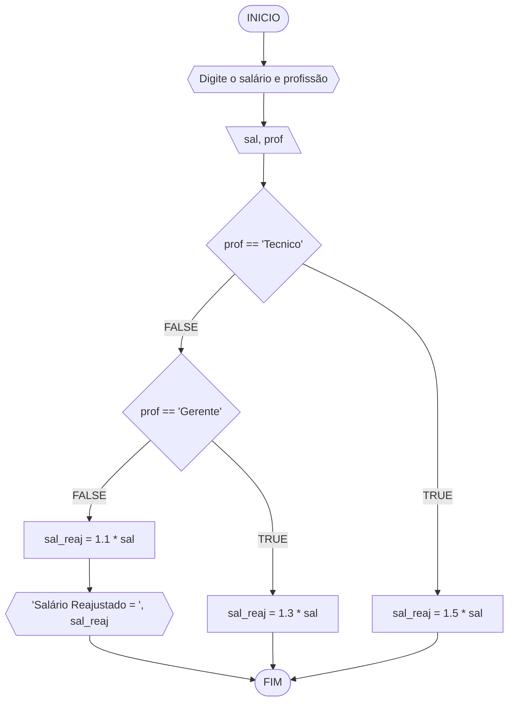
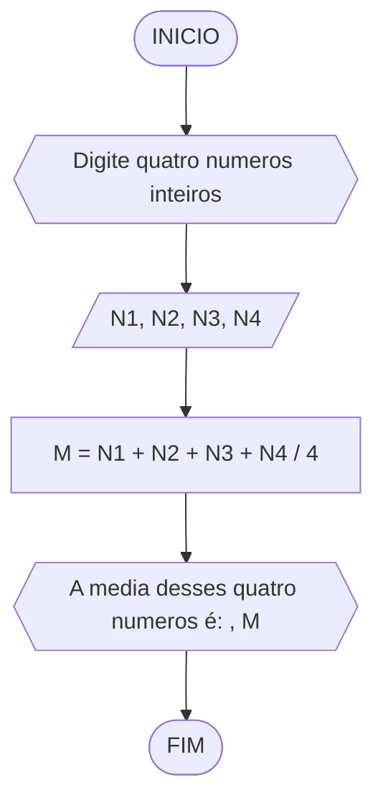
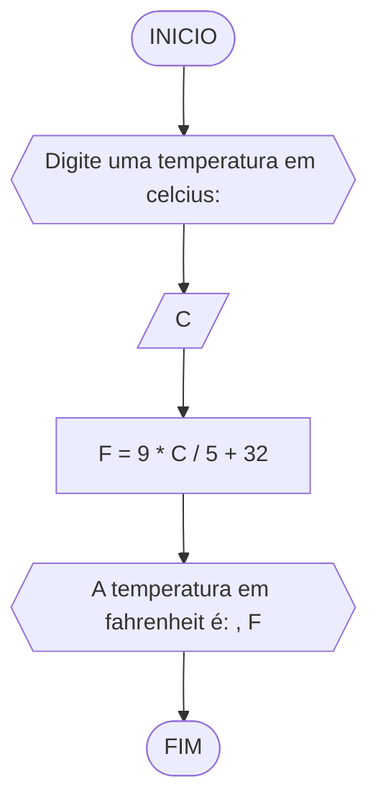
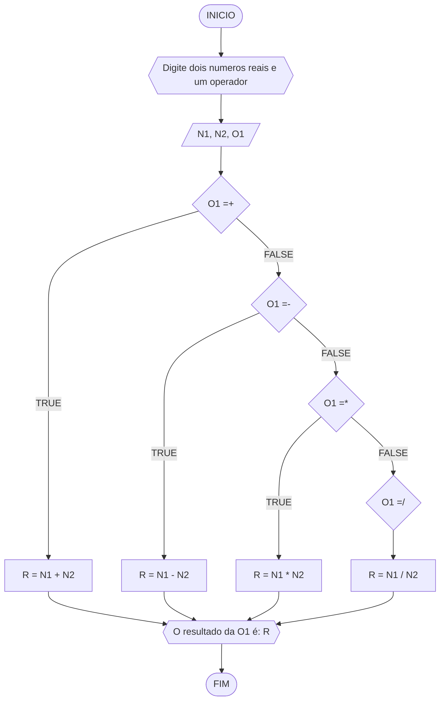
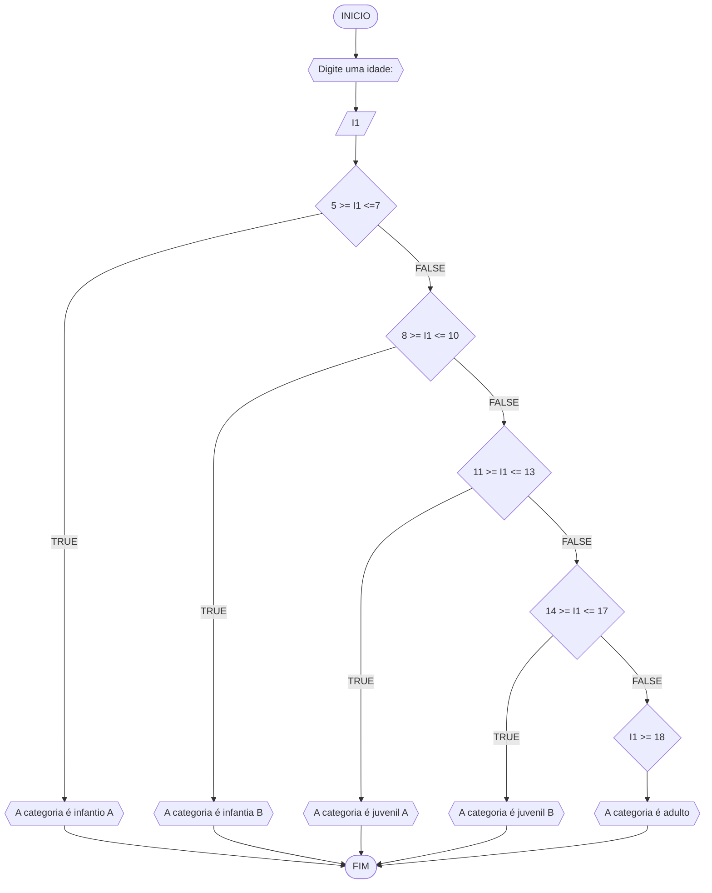

# UNIFOR
**Nome**: INACIO ARARIPE FIGUEIREDO <br>
**Disciplina**: Raciocínio lógico algorítm

## Exercício exemplo
Represente, em fluxograma e pseudocódigo, um algoritmo para calcular o adicional de salário de funcionário por cargo de uma empresa fictícia. Sabe-se que os funcionários de cargo técnico receberão reajuste de 50%, cargo de gerência, um reajuste de 30% e demais, um reajuste de 10%. 

#### Fluxograma


#### Pseudocódigo
```
1  ALGORITMO calReajuste
2  DECLARE  sal, sal_reaj: real, prof: caractere
3  INICIO
4  LEIA sal, prof
5  ESCOLHA
6   CASO prof == “Técnico”		// caso 1
7     sal_reaj ← 1.5 * sal
8   CASO prof = “Gerente”		// caso 2
9     sal_reaj ← 1.3 * sal
10  SENÃO
11    sal_reaj ← 1.1 * sal
12 FIM_ESCOLHA
13 ESCREVA “Salário Reajustado = “, sal_reaj
14 FIM
```

#### Teste
| sal | prof | prof == “Técnico” | prof = “Gerente” | sal_reaj | Saída |
| -- | -- | -- | -- | -- | -- |
| 1000 | Técnico | V | F | 1500 | “Salário Reajustado = 1500“ |
| 2000 | Gerente | F | V | 2600 | “Salário Reajustado = 2600“ |
| 9000 | Diretor | F | F | 9900 | “Salário Reajustado = 9900“ |

## Lista de exercícios 02

### Exercício 01 (2.5 pontos)
Calcule a média de quatro números inteiros dados.

#### FLUXOGRAMA


#### PSEUDOCODIGO

```
ALGORITMO media
DECLARE N1, N2, N3, N4, M: INTEIROS
INICIO
ESCREVA "Digite quatro numeros inteiros: "
LEIA N1, N2, N3, N4
M <- (N1 + N2 + N3 + N4) / 4
ESCREVA "A media desses quatro numeros é: ", M
FIM


```

#### Teste de mesa (0.5 ponto)

| N1 | N2 | N3 | N4 | M | SAIDA | 
|      --      |      --      |      --      |      --      |      --      |      --      | 
| 4     | 9       | 7    |  2     | 5.5    |      A media é: 5.5      |
| 3   | 8          | 5        | 9 | 13  |      A media é: 13      |
|      5      |      7      |      10      |      0      |      5.5      |      A media é: 5.5      |
|      8      |      9      |      6      |      2      |      6.25      |      A media é: 6.25      |

### Exercício 02 (2.5 pontos)
Leia uma temperatura dada em Celsius (C) e imprima o equivalente em Fahrenheit (F). (Fórmula de conversão: F = (9/5) * C + 32)

#### FLUXOGRAMA


#### PSEUDOCODIGO


```
ALGORITMO temperatura
DECLARE C, F REAIS
INICIO
ESCREVA "Digite uma temperatura em celcius: "
LEIA C
F = 9 * C / 5 + 32 ENTAO
	ESCREVA "A temperatura em fahrenheit é: ", F
FIM


```

#### Teste de mesa (0.5 ponto)

| C | F | SAIDA |
|      --      |      --      |      --      | 
| 50     | 122       | A temperatura em fahrenheit é: 122    |
| 90   | 194          | A temperatura em fahrenheit é: 194        |
|      20      |      68      |      A temperatura em fahrenheit é: 68      |

### Exercício 03 (2.5 pontos)
Receba dois números reais e um operador e efetue a operação correspondente com os valores recebidos (operandos). 
O algoritmo deve retornar o resultado da operação selecionada simulando todas as operações de uma calculadora simples.


#### FLUXOGRAMA



#### PSEUDOCODIGO

```
ALGORITMO operadores
DECLARE N1, N2, R : REAIS, O1: CARACTERES
INICIO 
ESCREVA "Digite dois numeros reais e um operador"
LEIA N1, N2, O1
SE O1 =+ ENTAO
	R = N1 + N2
SENAO 
O1 =- ENTAO
	R = N1 - N2
	SENAO 
	O1 =* ENTAO
		R = N1 * N2
		SENAO
		O1 =/ ENTAO
			R = N1 / N2
ESCREVA "O resultado da O1 é: R"
FIM
	
```


#### Teste de mesa (0.5 ponto)

| N1 | N2 |      O1      |      O1 =+      |      01 =-      |      O1 =*      |      O1 =/      |      R      |      SAIDA      |
|      --      |      --      |      --      |      --      |      --      |      --      |      --      |      --      |      --      | 
| 5     | 2       |      +      |      TRUE      |      FALSE      |      FALSE      |      FALSE      |      7      |      O resutado da soma é: 7      |
| 11   | 2          |      -      |      FALSE      |      TRUE      |      FALSE      |      FALSE      |      9      |      O resultado da subtração é: 9      |
| 18   | 2         |      *      |      FALSE      |      FALSE      |      TRUE      |      FALSE      |      36      |      O resultado da multiplicação é: 36      |
| 15   | 3          |      /      |      FALSE      |      FALSE      |      FALSE      |      TRUE      |      5      |      O resultado da divisão é: 5      |

### Exercício 04 (2.5 pontos)
Elaborar um algoritmo que, dada a idade, classifique nas categorias: infantil A (5 - 7 anos), infantil B (8 -10 anos), juvenil A (11 - 13 anos), juvenil B (14 -17 anos) e adulto (maiores que 18 anos).

#### FLUXOGRAMA


#### PSEUDOCODIGO
```
ALGORITMO categoria
DECLARE I1 NUMERAIS
INICIO
ESCREVA "Digite uma idade: "
LEIA I1
SE I1 5 >= I1 <= 7 ENTAO
	ESCREVA "A categoria é infantil A"
	SENAO
	8 >= I1 <= 10 ENTAO
		ESCREVA "A categoria é infantia B"
		SENAO 
		11 >= I1 <= 13 ENTAO
			ESCREVA "A categoria é juvenil A"
			SENAO 
			14 >= I1 <= 17 ENTAO
				ESCREVA "A categoria é juvenil B"
				SENAO
				I1 >= 18 ENTAO 
					ESCREVA "A categoria é adulto"
				FIM_SE
			FIM_SE
		FIM_SE
	FIM_SE
FIM
				
	
		

```


#### Teste de mesa (0.5 ponto)

| I1 | SAIDA | 
|      --      |      --      | 
| 5     | A categoria é infantil A       |
| 11   | A categoria é juvenil A          |
| 18   | A categoria é adulta         |
| 15   | A categoria é juvenil B          |
