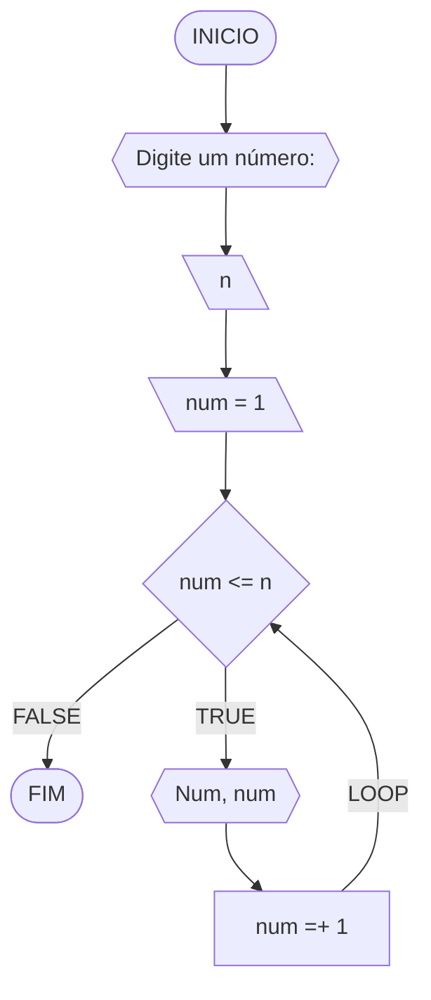
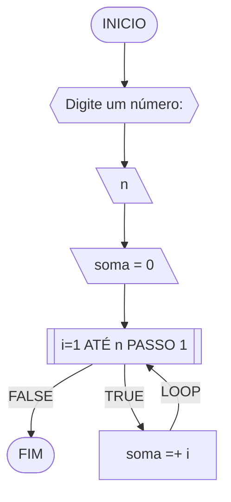
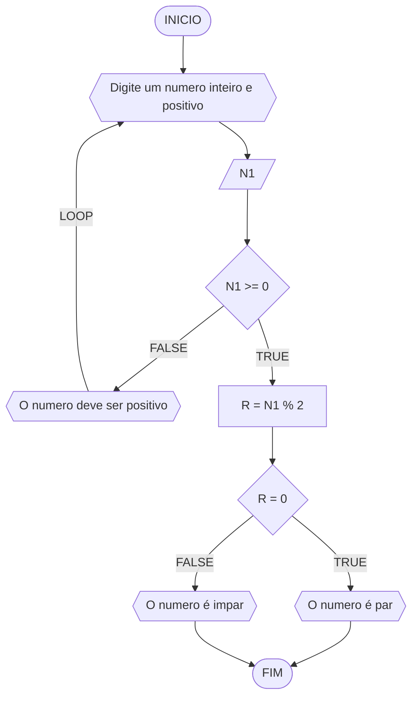
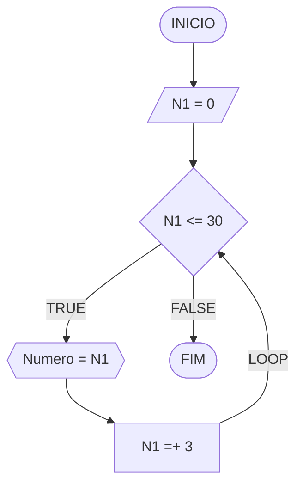
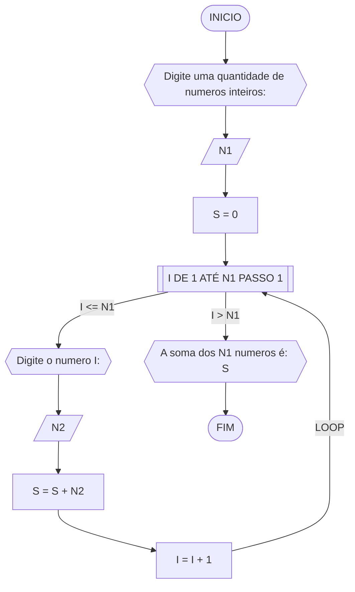
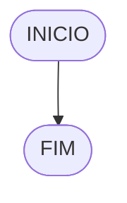

# UNIFOR
**Nome**: INACIO ARARIPE FIGUEIREDO <br>
**Disciplina**: Raciocínio lógico algorítm

## Exercício exemplo 1
Implemente e teste um programa que imprima os n primeiros números.

#### Fluxograma


#### Pseudocódigo
```
1 ALGORITMO print_n_primeiros
2 DECLARE n, num: INTEIRO
3 INICIO
4 ESCREVA “Digite um número: ”
4 LEIA n			// variável de entrada n
4 num ← 1			// variável num inicializada
5 ENQUANTO num <= n FAÇA	// n iterações
7	ESCREVA “Número ”, num
8	num ← num + 1		// num =+ 1 (incremento)
8 FIM_ENQUANTO
9 FIM
```

#### Teste de mesa
| it | n  | num | num <= n | Saída      | num =+ 1 |
| -- | -- | --  | --       | --         | --       |
| 1  | 10 | 1   | True     | Número 1   | 2        |
| 2  | 10 | 2   | True     | Número 2   | 3        |
| 3  | 10 | 3   | True     | Número 3   | 4        |
| 4  | 10 | 4   | True     | Número 4   | 5        |
| 5  | 10 | 5   | True     | Número 5   | 6        |
| 6  | 10 | 6   | True     | Número 6   | 7        |
| 7  | 10 | 7   | True     | Número 7   | 8        |
| 8  | 10 | 8   | True     | Número 8   | 9        |
| 9  | 10 | 9   | True     | Número 9   | 10       |
| 10 | 10 | 11  | True     | Número 10  | 11       |
| 11 | 10 | 11  | False    |            |          |

## Exercício exemplo 2
Implemente e teste um programa que some os n primeiros números.

#### Fluxograma


#### Pseudocódigo
```
1  ALGORITMO	soma_n_numeros()
2  DECLARE	n, i, soma: INTEIRO
3  INICIO
4  ESCREVA “Digite a quantidade de números: ”
5  LEIA n		// variável de entrada n
7  soma ← 0		// variável soma inicializada
6  PARA i DE 1 ATÉ n PASSO 1 FAÇA
7	soma ← soma + i	// soma =+ i (incremento)
8  FIM_PARA
9  ESCREVA “A soma é igual a ”, soma
10 FIM
```

#### Teste de mesa
| it | n  | soma | i  | soma =+ i |
| -- | -- | --   | -- | --        |
| 1  | 10 | 0    | 1  | 1         |
| 2  | 10 | 1    | 2  | 3         |
| 3  | 10 | 3    | 3  | 6         |
| 4  | 10 | 6    | 4  | 10        |
| 5  | 10 | 10   | 5  | 15        |
| 6  | 10 | 15   | 6  | 21        |
| 7  | 10 | 21   | 7  | 28        |
| 8  | 10 | 28   | 8  | 36        |
| 9  | 10 | 36   | 9  | 45        |
| 10 | 10 | 45   | 10 | 55        | 

## Lista de exercícios 03

### Exercício 01 (2.5 pontos)
Atualize o algoritmo para determinar se um número inteiro e positivo é par ou ímpar, usando uma laço condicional para aceitar apenas números maiores ou iguais a zero. 

#### FLUXOGRAMA


#### PSEUDOCODIGO

```
ALGORITMO par_impar
DECLARE N1, R : INTEIROS
INICIO
ESCREVA "Digite um numero inteiro e positivo"
LEIA N1
ENQUANTO N1 < 0 ENTAO
	ESCREVA "Digite um numero positivo"
FIM_ENQUANTO
SE N1 >= 0 ENTAO
	R <- N1 % 2
	SE R = 0 ENTAO 
		ESCREVA "O numero é par"
	SENAO 
		ESCREVA "O numero é impar"
FIM_SE
FIM
	


```

#### Teste de mesa (0.5 ponto)

| N1 | R | R = 0 | SAIDA | 
|      --      |      --      |      --      |      --      | 
| -2     |     |       | Digite um numero positivo    |
|      3      | 1        | FALSE | O numero é impar  |
|      4      |      0      |      TRUE      |      O numero é par      |
|      6      |      0      |      TRUE      |      O numero é par      |

### Exercício 02 (2.5 pontos)
Faça um algoritmo que exiba na tela uma contagem de 0 até 30, exibindo apenas os múltiplos de 3.


#### FLUXOGRAMA

#### PSEUDOCODIGO

```
ALGORITMO multiplos_3
DECLARE N1 : NUMERICOS
INICIO
N1 = 0
ENQUANTO N1 <= 30 FAÇA
	ESCREVA "Numero = N1"
	N1 <- N1 + 3
FIM_ENQUANTO
FIM


```

#### Teste de mesa (0.5 ponto)

|  | N1  | 	N2 |      N1 <= N2      |      SAIDA      |       N1 =+ 3      |  
|      --      |      --      |      --      |      --      |       --      |       --      |  
| 1     | 0       | 30    | TRUE           |      0      |       3      |  
| 2   | 3          | 30        |      TRUE      |      3      |       6      |  
|      3      |      6      |      30      |      TRUE      |      6      |       9      |  
|      4      |      9      |      30      |      TRUE      |      9      |       12      |  
|      5      |      12      |      30      |      TRUE      |      12      |       15      |
|      6      |      15      |      30      |      TRUE      |      15      |       18      | 
|      7      |      18      |      30      |      TRUE      |      18      |       21      | 
|      8      |      21      |      30      |      TRUE      |      21      |       24      | 
|      9      |      24      |      30      |      TRUE      |      24      |       27      | 
|      10      |      27      |      30      |      TRUE      |      27      |       30      | 
|      11      |      30      |      30      |      TRUE      |      30      |       33      |
|      12      |      33      |      30      |      FALSE      |      33      |       36      |

### Exercício 03 (2.5 pontos)
Dada uma sequência de números inteiros, calcular a sua soma. 
Por exemplo, para a sequência {12, 17, 4, -6, 8, 0}, o seu programa deve escrever o número 35.


#### FLUXOGRAMA



#### PSEUDOCODIGO

```
ALGORITMO soma
DECLARE N1, S, I, N2 : INTEIROS
INICIO
ESCREVA "Digite uma quantidade de numeros inteiros: "
LEIA N1
S <- 0
PARA I DE 1 ATE N1 PASSO 1 FAÇA
	ESCREVA "Digite o numero, I:  "
	LEIA N2
	S <- S + N2
	I <- I + 1
FIM_PARA
ESCREVA "A soma nos N1 numeros é: ", S
FIM


```
#### TESTE DE MESA

|      N1      |      S      |      I      |      N2      |      S = S + N2      |      I = I + 1      |
|      --      |      --      |      --      |      --      |      --      |      --      |
|      5      |      0      |      1      |      4      |      4      |      2      |
|      5      |      4      |      2      |      8      |      12      |      3      |
|      5      |      12      |      3      |      12      |      24      |      4      |
|      5      |      24      |      4      |      16      |      40      |      5      |
|      5      |      40      |      5      |      20      |      60      |      6      |
|      5      |      60      |      6      |            |            |            |

### Exercício 04 (2.5 pontos)
Escreva um programa que leia a nota de diversos alunos, até que seja digitada uma nota negativa. 
Nesse momento, ele mostra a média aritmética de todas as notas lidas e quantas notas foram lidas. 
Ex. Foram lidas 14 notas. A média aritmética é 6.75!

#### Fluxograma (1.0 ponto)



#### Pseudocódigo (1.0 ponto)

```
Algoritmo ClassificaCategoria
FIM_ALGORITMO
```

#### Teste de mesa (0.5 ponto)

| nome_coluna1 | nome_coluna2 | nome_coluna3 | nome_coluna4 | nome_coluna5 | 
|      --      |      --      |      --      |      --      |      --      | 
| Adicione     | espaço       | se quiser    |  alinhar     | as barras    |
| verticais,   | mas          | não é        | obrigatório. | Entendido ?  |
